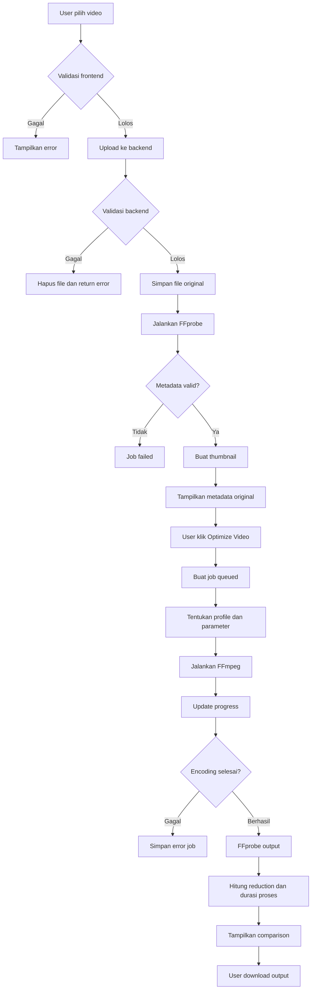

# WhatsApp Video Optimizer - PRD

## 1. Ringkasan Produk

WhatsApp Video Optimizer adalah aplikasi web untuk menganalisis dan mengoptimalkan video sebelum dikirim melalui WhatsApp. Aplikasi ini membaca metadata video, menentukan konfigurasi FFmpeg terbaik secara otomatis, memproses video ke format MP4 H.264 + AAC, lalu menampilkan perbandingan kualitas teknis dan ukuran file sebelum dan sesudah optimasi.

Tujuan utama aplikasi adalah mengurangi risiko video terlihat pecah, blur, atau terlalu terkompresi saat dikirim melalui WhatsApp dengan menyiapkan file yang sudah sesuai dengan karakteristik kompresi WhatsApp.

## 2. Tujuan

- Mengunggah video dari browser dengan drag and drop dan progress upload.
- Membaca metadata video secara akurat menggunakan FFprobe.
- Menampilkan informasi video asli.
- Menentukan preset optimasi otomatis berdasarkan resolusi, FPS, bitrate, orientasi, dan pilihan mode.
- Mengonversi video menggunakan FFmpeg.
- Menampilkan progress proses optimasi.
- Menampilkan before vs after comparison.
- Menyediakan file hasil optimasi untuk diunduh.
- Memberikan error handling yang jelas untuk file tidak valid, FFmpeg gagal, ukuran file terlalu besar, atau format tidak didukung.

## 3. Target Pengguna

- Content creator yang sering mengirim video via WhatsApp.
- Admin bisnis online yang mengirim katalog video produk.
- Pengguna umum yang ingin video tetap jernih saat dibagikan.
- Tim marketing yang membutuhkan proses cepat tanpa pengaturan encoding manual.

## 4. Scope MVP

Keputusan scope: aplikasi dibuat sederhana tanpa login dan tanpa database. Semua proses berjalan untuk user anonim, dan status job disimpan sebagai file JSON lokal.

### Masuk MVP

- Upload video MP4, MOV, AVI, MKV, WEBM.
- Batas ukuran file 500 MB.
- Analisis metadata dengan FFprobe.
- Optimasi dengan FFmpeg.
- Mode otomatis: WhatsApp Standard, WhatsApp HD, WhatsApp Status, WhatsApp Story.
- Queue processing sederhana berbasis file/job.
- Preview thumbnail video.
- Preview video original dan optimized.
- Download hasil optimasi.
- Dark mode.
- Mobile friendly.

### Tidak Masuk MVP

- Login user.
- Role user atau dashboard akun.
- Database MySQL/PostgreSQL/SQLite.
- Riwayat optimasi permanen.
- Payment premium.
- Cloud storage permanen.
- Batch upload banyak video sekaligus.
- Editor trim/crop manual.
- Subtitle editor.
- Watermark editor.

## 5. User Flow

1. User membuka halaman utama.
2. User memilih atau drag and drop video.
3. Frontend memvalidasi ekstensi dan ukuran file.
4. Video diupload ke backend dengan progress bar.
5. Backend menyimpan file original ke folder `storage/uploads`.
6. Backend menjalankan FFprobe untuk membaca metadata.
7. Backend membuat thumbnail awal video.
8. Frontend menampilkan metadata original.
9. User memilih mode optimasi, default `WhatsApp Standard`.
10. User menekan tombol `Optimize Video`.
11. Backend membuat job optimasi.
12. Backend menentukan parameter FFmpeg otomatis.
13. Backend menjalankan FFmpeg dan menyimpan progress.
14. Frontend melakukan polling status job.
15. Setelah selesai, backend membaca metadata output.
16. Frontend menampilkan perbandingan original vs optimized.
17. User memutar preview hasil dan mengunduh file.

## 6. Functional Requirements

### Upload Video

- Support format: `.mp4`, `.mov`, `.avi`, `.mkv`, `.webm`.
- Maksimal file: 500 MB.
- Drag and drop upload.
- Upload progress bar.
- Validasi MIME type dan ekstensi.
- Simpan nama file aman hasil sanitasi.
- Gunakan job ID unik agar nama file tidak bertabrakan.

### Video Analysis

Metadata yang wajib ditampilkan:

- Resolution.
- Width.
- Height.
- FPS.
- Duration.
- Video codec.
- Audio codec.
- Bitrate.
- File size.

Metadata wajib dibaca dari FFprobe, bukan hanya dari browser.

### WhatsApp Optimization

Output wajib:

- Container: MP4.
- Video codec: H.264 `libx264`.
- Audio codec: AAC.
- Audio bitrate: 128 kbps.
- Audio channel: stereo.
- Audio sample rate: 44.1 kHz.
- Preset: `medium`.
- Movflags: `+faststart`.
- CRF-based encoding.

Rules:

- Jika FPS > 30, output 30 FPS.
- Jika FPS <= 30, pertahankan FPS asli.
- Jika resolusi lebih besar dari 1920x1080, scale ke maksimal 1920x1080 dengan aspect ratio tetap.
- Jika resolusi lebih kecil dari 1080p, pertahankan resolusi asli.
- Pastikan width dan height genap karena H.264 membutuhkan dimensi divisible by 2.
- Untuk video vertikal Story/Status, targetkan rasio 9:16 jika mode tersebut dipilih.

### Preview Comparison

Tampilkan dua panel:

Original Video:

- Resolution.
- FPS.
- Bitrate.
- File size.

Optimized Video:

- Resolution.
- FPS.
- Bitrate.
- File size.

Tambahan:

- Original size.
- Optimized size.
- Reduction percentage.
- Saved file size.
- Processing duration.
- Mode optimasi yang digunakan.

### Queue Processing

MVP menggunakan queue sederhana berbasis file JSON:

- `queued`.
- `processing`.
- `completed`.
- `failed`.

Setiap job menyimpan:

- Job ID.
- Original path.
- Output path.
- Status.
- Upload metadata.
- Output metadata.
- Progress percentage.
- Error message.
- Created at.
- Started at.
- Finished at.

Semua data job disimpan di `storage/jobs/{job_id}.json`. Tidak ada database untuk MVP.

## 7. Non-Functional Requirements

- Maksimum upload: 500 MB.
- Proses encoding tidak boleh memblok UI.
- Backend harus memiliki batas timeout yang realistis.
- File temporary harus dapat dibersihkan berkala.
- Tidak ada login, session user, atau database.
- Endpoint download tidak boleh menerima path mentah dari user.
- Validasi file harus dilakukan di frontend dan backend.
- Error FFmpeg harus disimpan untuk debugging, tetapi pesan ke user tetap ringkas.
- UI harus responsif untuk mobile.
- Dark mode sebagai default atau toggle.

## 8. Struktur Folder Project

```text
wa-video-optimizer/
├── backend/
│   ├── main.py
│   ├── settings.py
│   └── services/
│       ├── ffmpeg_service.py
│       ├── metadata_service.py
│       ├── profile_service.py
│       ├── job_service.py
│       └── storage_service.py
├── public/
│   ├── index.html
│   ├── assets/
│   │   └── app.js
├── storage/
│   ├── uploads/
│   ├── optimized/
│   ├── thumbnails/
│   ├── jobs/
│   └── logs/
├── docs/
│   └── PRD.md
├── requirements.txt
├── README.md
└── .gitignore
```

## 9. Penyimpanan Data Tanpa Database

MVP tidak menggunakan database. Semua metadata job disimpan sebagai file JSON di folder `storage/jobs`.

Format file:

```text
storage/jobs/{job_id}.json
```

Contoh struktur JSON:

```json
{
  "job_id": "job_abc123",
  "status": "completed",
  "profile": "standard",
  "original_filename": "video.mp4",
  "stored_filename": "job_abc123_original.mp4",
  "output_filename": "job_abc123_optimized.mp4",
  "thumbnail_filename": "job_abc123.jpg",
  "progress": 100,
  "original": {
    "width": 1920,
    "height": 1080,
    "fps": 60,
    "duration": 92.4,
    "video_codec": "h264",
    "audio_codec": "aac",
    "bitrate": 12400000,
    "file_size": 125829120
  },
  "optimized": {
    "width": 1920,
    "height": 1080,
    "fps": 30,
    "duration": 92.4,
    "video_codec": "h264",
    "audio_codec": "aac",
    "bitrate": 4600000,
    "file_size": 60817408
  },
  "result": {
    "reduction_percent": 51.6,
    "saved_bytes": 65011712,
    "processing_seconds": 68.2
  },
  "error_message": null,
  "created_at": "2026-06-06T10:00:00+07:00",
  "started_at": "2026-06-06T10:00:05+07:00",
  "finished_at": "2026-06-06T10:01:13+07:00",
  "expires_at": "2026-06-07T10:01:13+07:00"
}
```

Aturan penyimpanan:

- File JSON dibuat saat upload berhasil.
- File JSON diperbarui saat optimasi berjalan.
- File original, output, thumbnail, dan JSON dihapus oleh cleanup sederhana berdasarkan `expires_at`.
- Karena tidak ada login, user hanya mengakses job melalui `job_id`.

## 10. Flowchart Proses Optimasi



## 11. UI/UX Wireframe

### Desktop Layout

```text
┌──────────────────────────────────────────────────────────────────────┐
│ WhatsApp Video Optimizer                         [Dark Mode Toggle]  │
├──────────────────────────────────────────────────────────────────────┤
│                                                                      │
│ ┌──────────────────────── Upload Area ─────────────────────────────┐ │
│ │ Drag & drop video here                                           │ │
│ │ MP4, MOV, AVI, MKV, WEBM up to 500 MB                            │ │
│ │ [Select Video]                                                   │ │
│ │ Upload Progress: [==================== 65%]                      │ │
│ └──────────────────────────────────────────────────────────────────┘ │
│                                                                      │
│ ┌──────────── Original Metadata ────────────┐ ┌──── Video Preview ┐ │
│ │ Resolution: 1920x1080                     │ │                  │ │
│ │ FPS: 60                                   │ │   Thumbnail /    │ │
│ │ Duration: 00:01:32                        │ │   Video Player   │ │
│ │ Codec: H.264                              │ │                  │ │
│ │ Bitrate: 12.4 Mbps                        │ │                  │ │
│ │ File Size: 120 MB                         │ │                  │ │
│ └───────────────────────────────────────────┘ └──────────────────┘ │
│                                                                      │
│ ┌──────────────────────── Optimization Mode ───────────────────────┐ │
│ │ [Standard] [HD] [Status] [Story]                                 │ │
│ │ [Optimize Video]                                                 │ │
│ │ Processing: [==================== 42%]                           │ │
│ └──────────────────────────────────────────────────────────────────┘ │
│                                                                      │
│ ┌────────────── Original Video ─────────────┐ ┌── Optimized Video ┐ │
│ │ video player                              │ │ video player      │ │
│ │ 1920x1080 | 60 FPS | 120 MB               │ │ 1920x1080 | 30 FPS│ │
│ └───────────────────────────────────────────┘ │ 58 MB             │ │
│                                               └───────────────────┘ │
│ ┌──────────────────── Result Summary ──────────────────────────────┐ │
│ │ Original Size: 120 MB | Optimized Size: 58 MB                    │ │
│ │ Reduction: 51.6% | Saved: 62 MB | Time: 00:01:08                 │ │
│ │ [Download Optimized Video]                                       │ │
│ └──────────────────────────────────────────────────────────────────┘ │
└──────────────────────────────────────────────────────────────────────┘
```

### Mobile Layout

```text
┌──────────────────────────────┐
│ WhatsApp Video Optimizer     │
│ [Dark Mode]                  │
├──────────────────────────────┤
│ Drag & Drop / Select Video   │
│ Progress 65%                 │
├──────────────────────────────┤
│ Original Metadata            │
│ Resolution, FPS, Duration    │
│ Codec, Bitrate, File Size    │
├──────────────────────────────┤
│ Preview                      │
├──────────────────────────────┤
│ Mode                         │
│ [Standard] [HD]              │
│ [Status] [Story]             │
│ [Optimize Video]             │
├──────────────────────────────┤
│ Original Video               │
├──────────────────────────────┤
│ Optimized Video              │
├──────────────────────────────┤
│ Reduction Summary            │
│ [Download]                   │
└──────────────────────────────┘
```

## 12. API Endpoints

### `POST /api/upload`

Upload video original.

Request:

- `video`: file.

Response sukses:

```json
{
  "success": true,
  "job_id": "job_abc123",
  "metadata": {
    "width": 1920,
    "height": 1080,
    "fps": 60,
    "duration": 92.4,
    "video_codec": "h264",
    "audio_codec": "aac",
    "bitrate": 12400000,
    "file_size": 125829120
  },
  "thumbnail_url": "/api/thumbnail/job_abc123"
}
```

### `GET /api/jobs/{job_id}`

Mengambil detail job dan metadata.

### `POST /api/optimize`

Memulai optimasi.

Request:

```json
{
  "job_id": "job_abc123",
  "profile": "standard"
}
```

Response:

```json
{
  "success": true,
  "job_id": "job_abc123",
  "status": "queued"
}
```

### `GET /api/optimize/{job_id}/status`

Polling status proses.

Response:

```json
{
  "success": true,
  "job_id": "job_abc123",
  "status": "processing",
  "progress": 42
}
```

### `GET /api/compare/{job_id}`

Mengambil metadata original dan optimized.

### `GET /api/download/{job_id}`

Download video hasil optimasi.

### `GET /api/thumbnail/{job_id}`

Mengambil thumbnail video.

### `DELETE /api/jobs/{job_id}`

Menghapus file original, output, thumbnail, dan metadata job.

## 13. Optimization Profiles

### WhatsApp Standard

Target:

- Ukuran kecil.
- Kualitas baik.
- Cocok untuk chat biasa.

Settings:

- CRF: 24.
- Max 1080p.
- 720p bitrate cap: 2500k.
- 1080p bitrate cap: 4500k.
- FPS max: 30.

### WhatsApp HD

Target:

- Kualitas lebih tinggi.
- Ukuran lebih besar.
- Cocok untuk video penting.

Settings:

- CRF: 21.
- Max 1080p.
- 720p bitrate cap: 3500k.
- 1080p bitrate cap: 6000k.
- FPS max: 30.

### WhatsApp Status

Target:

- Durasi dan ukuran efisien untuk status.
- Cocok untuk vertical atau square content.

Settings:

- CRF: 23.
- Max height: 1280 jika vertikal, 1080 jika horizontal.
- FPS max: 30.
- Audio AAC 128k.

Catatan: WhatsApp Status memiliki batas durasi pada sisi aplikasi WhatsApp. Sistem MVP tidak memotong video otomatis kecuali fitur trimming ditambahkan.

### WhatsApp Story

Target:

- Output vertikal 9:16.
- Cocok untuk story-style vertical video.

Settings:

- CRF: 22.
- Target 1080x1920 jika sumber cukup besar.
- Jika sumber horizontal, gunakan scale + pad agar tidak memotong konten secara agresif.
- FPS max: 30.

## 14. FFmpeg Commands

### Metadata dengan FFprobe

```bash
ffprobe -v error -print_format json -show_format -show_streams input.mp4
```

### Thumbnail Preview

```bash
ffmpeg -y -ss 00:00:01 -i input.mp4 -frames:v 1 -q:v 2 thumbnail.jpg
```

### WhatsApp Standard - Horizontal 720p

```bash
ffmpeg -y -i input.mp4 \
  -map 0:v:0 -map 0:a? \
  -c:v libx264 \
  -crf 24 \
  -preset medium \
  -r 30 \
  -vf "scale='min(1280,iw)':-2" \
  -maxrate 2500k \
  -bufsize 5000k \
  -pix_fmt yuv420p \
  -movflags +faststart \
  -c:a aac \
  -b:a 128k \
  -ac 2 \
  -ar 44100 \
  output.mp4
```

### WhatsApp Standard - 1080p

```bash
ffmpeg -y -i input.mp4 \
  -map 0:v:0 -map 0:a? \
  -c:v libx264 \
  -crf 24 \
  -preset medium \
  -r 30 \
  -vf "scale='if(gt(iw,1920),1920,iw)':'if(gt(ih,1080),1080,ih)':force_original_aspect_ratio=decrease,scale=trunc(iw/2)*2:trunc(ih/2)*2" \
  -maxrate 4500k \
  -bufsize 9000k \
  -pix_fmt yuv420p \
  -movflags +faststart \
  -c:a aac \
  -b:a 128k \
  -ac 2 \
  -ar 44100 \
  output.mp4
```

### WhatsApp HD - 1080p

```bash
ffmpeg -y -i input.mp4 \
  -map 0:v:0 -map 0:a? \
  -c:v libx264 \
  -crf 21 \
  -preset medium \
  -r 30 \
  -vf "scale='if(gt(iw,1920),1920,iw)':'if(gt(ih,1080),1080,ih)':force_original_aspect_ratio=decrease,scale=trunc(iw/2)*2:trunc(ih/2)*2" \
  -maxrate 6000k \
  -bufsize 12000k \
  -pix_fmt yuv420p \
  -movflags +faststart \
  -c:a aac \
  -b:a 128k \
  -ac 2 \
  -ar 44100 \
  output.mp4
```

### WhatsApp Status

```bash
ffmpeg -y -i input.mp4 \
  -map 0:v:0 -map 0:a? \
  -c:v libx264 \
  -crf 23 \
  -preset medium \
  -r 30 \
  -vf "scale='min(1080,iw)':-2:force_original_aspect_ratio=decrease,scale=trunc(iw/2)*2:trunc(ih/2)*2" \
  -maxrate 4000k \
  -bufsize 8000k \
  -pix_fmt yuv420p \
  -movflags +faststart \
  -c:a aac \
  -b:a 128k \
  -ac 2 \
  -ar 44100 \
  output.mp4
```

### WhatsApp Story 9:16

```bash
ffmpeg -y -i input.mp4 \
  -map 0:v:0 -map 0:a? \
  -c:v libx264 \
  -crf 22 \
  -preset medium \
  -r 30 \
  -vf "scale=1080:1920:force_original_aspect_ratio=decrease,pad=1080:1920:(ow-iw)/2:(oh-ih)/2,setsar=1" \
  -maxrate 6000k \
  -bufsize 12000k \
  -pix_fmt yuv420p \
  -movflags +faststart \
  -c:a aac \
  -b:a 128k \
  -ac 2 \
  -ar 44100 \
  output.mp4
```

### Progress Parsing

Gunakan opsi progress agar backend dapat membaca progres tanpa parsing log biasa:

```bash
ffmpeg -y -i input.mp4 \
  [encoding options] \
  -progress pipe:1 \
  -nostats \
  output.mp4
```

Progress dapat dihitung dari:

- `out_time_ms / duration_ms * 100`.
- Batasi maksimal 99% sampai proses benar-benar selesai.

## 15. Automatic Parameter Decision

Pseudo logic:

```text
if fps > 30:
    output_fps = 30
else:
    output_fps = original_fps

if width > 1920 or height > 1080 for horizontal:
    scale down to fit inside 1920x1080
else:
    keep original resolution

if output height <= 720:
    standard maxrate = 2500k
    hd maxrate = 3500k
else:
    standard maxrate = 4500k
    hd maxrate = 6000k

if source bitrate is already lower than target cap:
    use CRF without forcing a higher bitrate
else:
    use CRF with maxrate/bufsize cap

if profile is story:
    scale and pad to 1080x1920
```

## 16. Analisis Teknik Agar Video Tidak Pecah di WhatsApp

WhatsApp tetap dapat melakukan kompresi ulang terhadap video yang dikirim. Strategi terbaik bukan membuat bitrate setinggi mungkin, tetapi menyiapkan file yang mudah diproses WhatsApp tanpa kompresi ekstrem.

Rekomendasi teknis:

- Gunakan H.264 + AAC dalam container MP4 karena paling kompatibel.
- Gunakan `yuv420p` agar video kompatibel di banyak perangkat.
- Batasi FPS ke 30. Video 60 FPS sering dikompresi lebih agresif dan menghasilkan ukuran besar tanpa manfaat besar di WhatsApp.
- Hindari resolusi lebih dari 1080p untuk chat biasa. 4K hampir pasti akan dikompresi ulang besar-besaran.
- Gunakan CRF agar kualitas visual adaptif terhadap kompleksitas gambar.
- Gunakan `-maxrate` dan `-bufsize` agar bitrate tidak melonjak terlalu tinggi pada scene kompleks.
- Gunakan `+faststart` agar metadata MP4 berada di awal file, sehingga playback dan upload lebih cepat.
- Jangan melakukan upscale video kecil. Upscale membuat file lebih besar tanpa menambah detail asli.
- Pertahankan aspect ratio. Distorsi atau stretch membuat kualitas terlihat buruk.
- Pastikan dimensi genap untuk menghindari masalah encoder H.264.
- Gunakan preset `medium` sebagai kompromi kualitas, ukuran, dan waktu proses.
- Untuk video dengan banyak noise atau low-light, CRF terlalu rendah dapat membuat file besar. Standard mode sebaiknya CRF 24, HD mode CRF 21.
- Untuk teks kecil di video, gunakan HD mode karena WhatsApp compression mudah merusak detail tajam seperti tulisan.
- Hindari re-encode berkali-kali. User sebaiknya mengunggah file original, bukan file yang sudah sering dikompres.

Tradeoff utama:

- CRF lebih rendah menghasilkan kualitas lebih baik tetapi ukuran lebih besar.
- Bitrate cap terlalu rendah membuat blocking/blur.
- Bitrate cap terlalu tinggi membuat WhatsApp lebih mungkin melakukan kompresi ulang berat.
- 1080p 30 FPS dengan 4-6 Mbps biasanya menjadi titik seimbang untuk WhatsApp HD.
- 720p 30 FPS dengan 2-3 Mbps biasanya cukup untuk chat standar.

## 17. Error Handling

Error yang perlu ditangani:

- File melebihi 500 MB.
- Ekstensi tidak didukung.
- MIME type tidak cocok.
- File upload tidak lengkap.
- FFprobe gagal membaca metadata.
- Video tidak memiliki stream video.
- FFmpeg tidak tersedia di server.
- Encoding gagal.
- Output tidak terbentuk.
- Disk penuh.
- Job ID tidak ditemukan.
- File hasil sudah expired.

Format response error:

```json
{
  "success": false,
  "error": {
    "code": "FILE_TOO_LARGE",
    "message": "Ukuran file maksimal 500 MB."
  }
}
```

## 18. Security Considerations

- Jangan pernah mengeksekusi path langsung dari input user.
- Gunakan `escapeshellarg` untuk semua path dan argumen shell.
- Batasi ekstensi dan MIME type.
- Simpan file di luar folder publik jika memungkinkan.
- Download melalui endpoint yang memvalidasi `job_id`.
- Beri expiry pada file.
- Bersihkan file lama dengan scheduled cleanup.
- Batasi jumlah job per IP jika dipublikasi.
- Jangan expose full command dan path server ke frontend.

## 19. Acceptance Criteria

- User dapat upload video valid sampai 500 MB.
- Metadata original tampil setelah upload.
- User dapat memilih mode optimasi.
- Optimasi menghasilkan file MP4 H.264 + AAC.
- FPS output tidak lebih dari 30.
- Resolusi output tidak lebih dari 1920x1080 untuk mode standard/HD horizontal.
- File output dapat dipreview dan diunduh.
- UI menampilkan original size, optimized size, reduction percentage, saved size, dan processing duration.
- Error ditampilkan dengan pesan jelas.
- Aplikasi bisa digunakan di desktop dan mobile.
